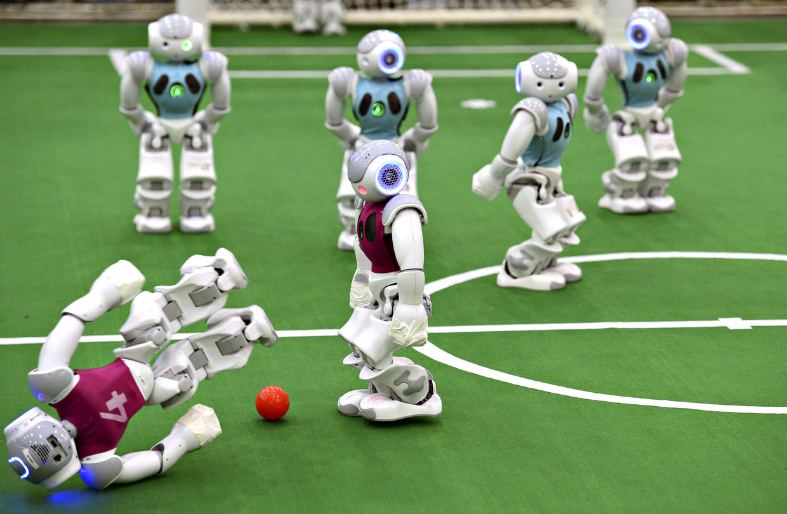

# robocupThesis

This is my bachelor thesis project where i programmed the code for the behaviour of an autonomous defender robot that intercept a moving ball with the Italian team SPQR for the Robocup League
using c++ on their framework based on B-Human Architecture (follows Agent Oriented Programming principles).

I cannot disclose the full framework code,however the repository contains some files I have worked on.

